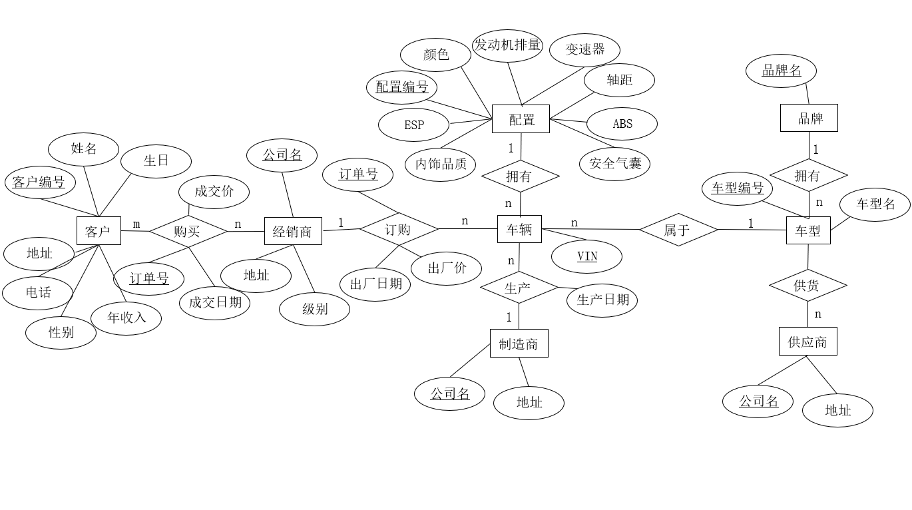

# 收集的材料
## 汽车销售链体系架构
供应商：主要功能供货，产品可自己生产，也可自己采购；
代理商：代理某品牌产品的供应商；
经销商：销售某产品的供应商，可以是代理商，现货；
制造商：生产某种产品的厂家；

扩展资料：
供应商是向企业及其竞争对手供应各种所需资源的企业和个人，包括提供原材料、设备、能源、劳务等。它们的情况如何会对企业的营销活动产生巨大的影响，如原材料价格变化、短缺等都会影响企业产品的价格和交货期，并会因而削弱企业与客户的长期合作与利益，因此，营销人员必须对供应商的情况有比较全面的了解和透彻的分析。供应商既是商务谈判中的对手更是合作伙伴。《零售商供应商公平交易管理办法》规定：供应商是指直接向零售商提供商品及相应服务的企业及其分支机构、个体工商户，包括制造商、经销商和其他中介商。或称为“厂商”，即供应商品的个人或法人。供应商可以是农民、生产基地、制造商、代理商、批发商（限一级）、进口商等，应避免太多中间环节的供应商。例如：二级批发商、经销商、皮包公司（倒爷）、或亲友所开的公司。
商务代理是代理人受企业的委托，在一定的区域和处所内，在一定的代理权限下，以企业的名义代替企业行使经济行为（包括销售商品及其他行为），其法律后果直接归属于企业。经销商，就是在某一区域和领域只拥有销售或服务的单位或个人。经销商具有独立的经营机构 ，拥有商品的所有权（买断制造商的产品/服务），获得经营利润 ，多品种经营 ，经营活动过程不受或很少受供货商限制 ，与供货商责权对等。
制造商或称为“生产厂商”，指创造产品的企业。

## VIN码
vin码是指车辆识别码，由17位字符组成，分别代表：1、第一位表示地理区域；2、第二位表示国别；3、第三位表示汽车制造厂商；4、第四到八位表示车辆特征代码；5、第九位表示检验位；6、第十位表示年份；7、第十一位表示装配厂；8、第十二到十七位表示生产顺序号。

## 长城汽车相关资料
### 制造商
长城汽车的生产基地包括：1。保定基地。2.天津基地。3.江苏张家港基地。4.浙江平湖基地。5.徐水基地。6.重庆永川基地。7.山东日照基地。8.江苏泰州基地。已经形成了八大生产基地，实力比较雄厚。
保定长城华北汽车有限责任公司 河北省高碑店市幸福南大街66号
天津长城汽车有限公司 天津市天津开发区西区中南组团南大街以北
张家港长城汽车研发有限公司 江苏省苏州市张家港市杨舍镇中兴中路404号绿智科技中心（A幢）
长城汽车股份有限公司平湖分公司 浙江省嘉兴市平湖市经济技术开发区新凯路888号101室
长城汽车股份有限公司徐水分公司 河北省保定市徐水区朝阳北大街（徐）299号
重庆市永川区长城汽车零部件有限公司 重庆市永川区凤龙大道666号
日照魏牌汽车有限公司 山东省日照市经济开发区杭州路99号
长城汽车股份有限公司泰州分公司 江苏省泰州市高港区通江东路666号

### 供应商
北京海纳川航盛汽车电子有限公司	北京市大兴区采育镇北京采育经济开发区育隆大街1号
重庆红宇摩擦制品有限公司 重庆市璧山区璧城街道景山路110号
重庆长风基铨机械有限公司 重庆市江津区德感街道德园路409号
重庆红旗缸盖制造有限公司 重庆市璧山区璧城街道璧东温泉园区牛角湾
重庆沃特尔粉末冶金有限公司 重庆市铜梁区工业园区玉泉路11号
佛山市恒威汽车动力转向器有限公司 佛山市高明区西安河江开发区跃华路广德街5号
沧州新旺汽车散热器制造有限公司 河北省青县陈咀乡张楼村中间
沧州宏悦车灯塑业有限公司 河间市卧佛堂卧安东路９号
保定市永大玻璃钢制品厂 保定市高新区隆兴西路１６号
广州市科立汽车电器有限公司 广州市科立汽车电器有限公司
中山市耀华汽车部件实业有限公司 中山市黄圃镇大岑工业区成业大道37号三层
广东多纳勒振华汽车系统有限公司 佛山市顺德区高新区（容桂）建业中路9号
柳州福臻模具有限公司 柳州市高新一路C-4号
贵州天义汽车电器有限公司 贵州省遵义市汇川区汇川大道延长线遵义V谷标准化厂房一期五号厂房
保定市永大玻璃钢制品厂 保定市高新区隆兴西路１６号

### 品牌
长城旗下有四个品牌，第一个是长城品牌，主要生产轿车和皮卡。第二是哈弗品牌成立于2013年。第三个是wey品牌，中国豪华SUV品牌。第四个品牌是欧拉品牌，是2018年成立的纯电动汽车品牌。

长城
哈弗
魏
欧拉

# 用到的软件
## 数据库环境
华为云opengauss
## E-R图绘制
PPT
## 数据生成
### faker库 
[faker库简介](https://blog.csdn.net/u010553139/article/details/106112667?ops_request_misc=%257B%2522request%255Fid%2522%253A%2522167127032616782414952639%2522%252C%2522scm%2522%253A%252220140713.130102334..%2522%257D&request_id=167127032616782414952639&biz_id=0&utm_medium=distribute.pc_search_result.none-task-blog-2~all~top_positive~default-1-106112667-null-null.142^v68^pc_rank_34_queryrelevant25,201^v4^add_ask,213^v2^t3_esquery_v2&utm_term=faker%E5%BA%93&spm=1018.2226.3001.4187)
### excel 
[excel转sql方法](https://blog.csdn.net/m0_67695717/article/details/127406830?ops_request_misc=&request_id=&biz_id=102&utm_term=excel%E8%BD%ACsql%E8%84%9A%E6%9C%AC&utm_medium=distribute.pc_search_result.none-task-blog-2~all~sobaiduweb~default-5-127406830.142^v68^pc_rank_34_queryrelevant25,201^v4^add_ask,213^v2^t3_esquery_v2&spm=1018.2226.3001.4187)
[python编辑excel方法](https://blog.csdn.net/weixin_51330175/article/details/122914074?ops_request_misc=%257B%2522request%255Fid%2522%253A%2522167127537816782395387177%2522%252C%2522scm%2522%253A%252220140713.130102334..%2522%257D&request_id=167127537816782395387177&biz_id=0&utm_medium=distribute.pc_search_result.none-task-blog-2~all~top_positive~default-2-122914074-null-null.142^v68^pc_rank_34_queryrelevant25,201^v4^add_ask,213^v2^t3_esquery_v2&utm_term=python%E5%86%99excel&spm=1018.2226.3001.4187)
[xlwt日期格式](https://blog.csdn.net/kuangzhi9124/article/details/81944674?ops_request_misc=%257B%2522request%255Fid%2522%253A%2522167133206016782425642120%2522%252C%2522scm%2522%253A%252220140713.130102334.pc%255Fall.%2522%257D&request_id=167133206016782425642120&biz_id=0&utm_medium=distribute.pc_search_result.none-task-blog-2~all~first_rank_ecpm_v1~rank_v31_ecpm-1-81944674-null-null.142^v68^pc_rank_34_queryrelevant25,201^v4^add_ask,213^v2^t3_esquery_v2&utm_term=%E6%97%A5%E6%9C%9F%20xlwt&spm=1018.2226.3001.4187)
## 资料整理
markdown [markdown语法集合](https://blog.csdn.net/VistorsYan/article/details/109138602?spm=1001.2014.3001.5506)

# 实践步骤
## 分析实体之间的关系并构建E-R图
### 实体
客户：客户编号、姓名、地址、电话、性别、年收入、生日
经销商：公司名、地址、级别
车辆：车辆识别号（VIN）、<u>配置编号</u>、<u>车型编号</u>
车型：车型编号、车型名称、<u>品牌名</u>
配置：配置编号、颜色、发动机排量、变速器、轴距、ABS（防抱死制动系统）、ESP（车身稳定系统）、安全气囊、内饰品质
品牌：品牌名
制造商：公司名、地址
供应商：公司名、地址

根据《企业名称等级管理规定》第六条：企业只准使用一个企业名称，在登记主管机关辖区内不得与登记注册的同行业企业名称相同或者近似。所以公司名是独一无二的，可以用作主键。
### 联系
购买：订单号、成交日期、成交价
生产：生产日期
订购：订单号、出厂日期、出厂价
供货：订单号、订单日期、零件类型、数量、零件单价、订单价格
### E-R图

## 建立关系模式

## 生成数据
客户数据：faker库生成
经销商数据：faker库生成
制造商信息：天眼查
供应商信息：百度（甄选了一部分）+天眼查
品牌信息：百度
车辆信息：python生成
车型信息：百度
配置信息：excel生成
供货、订购、生产、购买：自己构建

<u>每一步数据都有微调，以最后数据为准</u>

## 建立约束
主键约束
外键约束：由于所有关系的主键在另一个表中都是键，不符合外键的定义，所以这些关系中没有外键
check约束：判断性别只能为男女中的一个

## 建立索引
客户：收入索引
订购：出厂价索引
购买：售价索引
供应：供应原件和供应商索引

## 问题
1、查询各个品牌对应车辆的出厂价之和
2、查询收益最高的经销商
3、北京海纳川航盛汽车电子有限公司产出的电子元件有问题，查询购买了这些车型的客户的姓名与电话
4、查询售价高于十二万但是没有ESP系统的车的VIN
